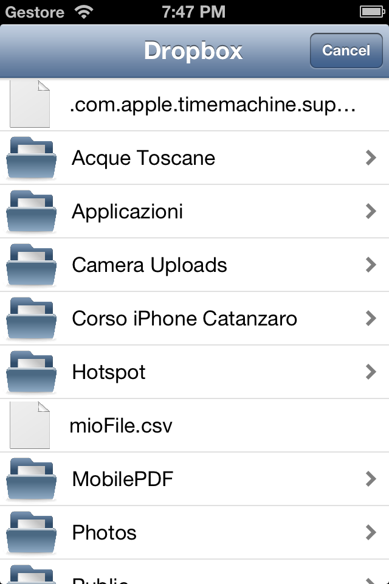
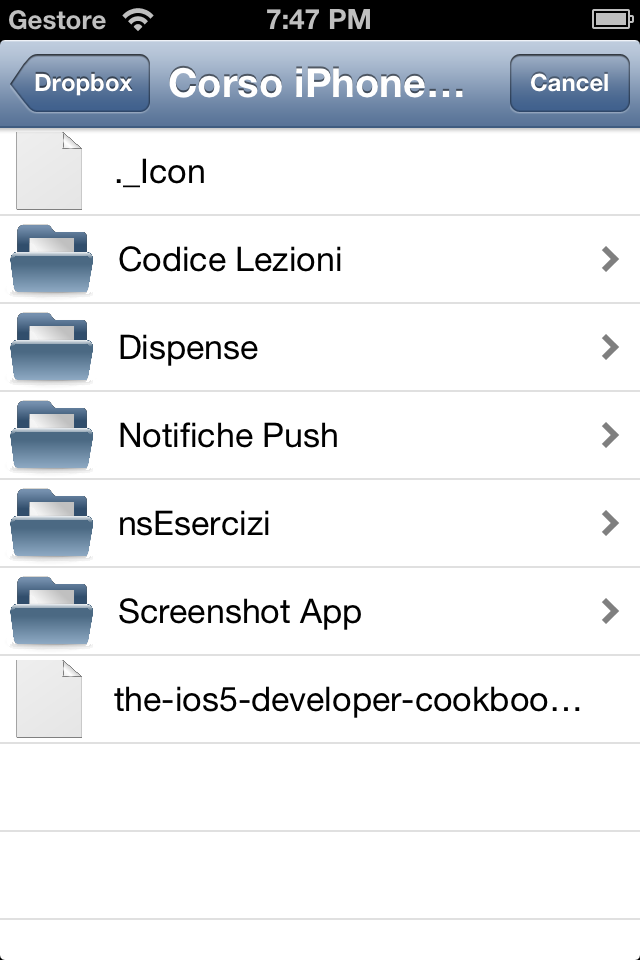
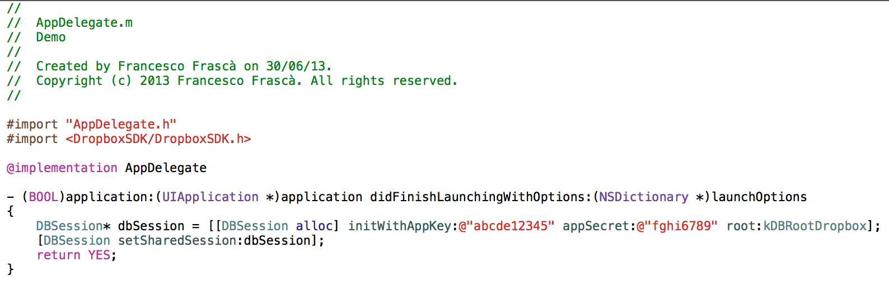
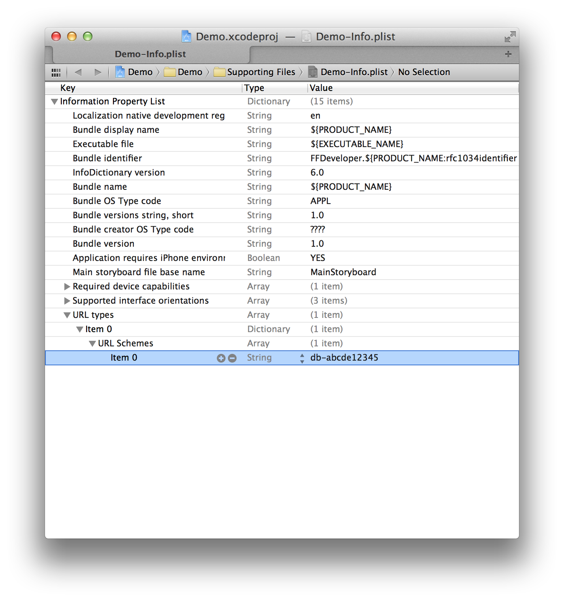

DropBoxPicker
=============

A simple framework to use a PickerViewController to select file from a DropBox Account.

 &nbsp; 

## Requirements

DropBoxPicker works on any iOS version and is compatible with only ARC projects.  

It depends on the following Apple frameworks, which should already be included with most Xcode templates:  

`Foundation.framework`  
`UIKit.framework`  
`CoreGraphics.framework`  
`Security.framework`  
`QuartzCore.framework`

You will need also to add `DropBoxSDK.framework`. This is the DropBox Core API SDK for ios.  

## Adding DropBoxPicker to your project

You can add DropBoxPicker as a framework to your project or workspace.

Download the latest code version or add the repository as a git submodule to your git-tracked project.  
Open your project in Xcode, then drag and drop `DropBoxPicker.framework` onto your project in the Frameworks directory. You will need also to drag and drop the `DropBoxPicker.bundle` onto your project in the main bundle.

Include DropBoxPicker wherever you need it with `#import <DropBoxPicker/DropBoxPicker.h>`.

For the other configurations look at the DropBox Core API SDK Getting Started Guide.

##Usage

1. Ensure that your application is still linked with DropBox:

  		if (![[DBSession sharedSession] isLinked])
				[[DBSession sharedSession] linkFromController:self];

2. The class that want to start the picker needs to implement the `DBPDropBoxPickerDelegate` like this:

		@interface ViewController : UIViewController <DBPDropBoxPickerDelegate>

3. To call the picker you have to use the following code:

		DBPDropBoxPickerViewController *picker = [[DBPDropBoxPickerViewController alloc] initWithDropBoxPath:ROOT_PATH];
		picker.delegate = self;
		UINavigationController *navController = [[UINavigationController alloc] initWithRootViewController:picker];
		[self presentViewController:navController animated:YES completion:^{
		
		}];

	`ROOT_PATH` here, is a NSString that represent the dropbox path for the picker. When it starts, it is opened at this path.  
	You can use  
		
		[[DBPDropBoxPickerViewController alloc] initWithDropBoxPath:@"/"]  

	for the root path.

4. You need also to implement the two methods of the `DBPDropBoxPickerDelegate`:

		- (void)errorChoosingFile:(DBPDropBoxPickerViewController *)picker
		{
			NSLog(@"Error choosing file");
		}

		- (void)dropBoxPickerController:(DBPDropBoxPickerViewController *)picker fileChoosedWithPath:(NSString *)dropBoxPath
		{
			NSLog(@"File choosed with path %@", dropBoxPath);
    		[[picker navigationController] dismissViewControllerAnimated:NO completion:^{
        
    		}];
		}

	The first method, `errorChoosingFile:`, is called if there was an error with dropbox connection (meaby the application is not linked with the account).  
	The second one, `dropBoxPickerController: fileChoosedWithPath:`, is called when the user choose a file with the given dropBoxPath.  
	Then, you can use this path to download the file with the DropBoxSDK.

## The Demo Project
Take a look at the bundled demo project to see a very simple example.  
You have to change the `APP_KEY` and the `APP_SECRET` in the AppDelegate with yours.  
You need also to change the `APP_KEY` in the "URL_Schemes" in "URL_Types" property in the `Demo_Info.plist` file. If your `APP_KEY` is, for example, "abcde12345" and your `SECRET_KEY` is "fghi6789" you have to change the Demo Project like the pictures below).

## License

This code is distributed under the terms and conditions of the [MIT license](LICENSE). 
